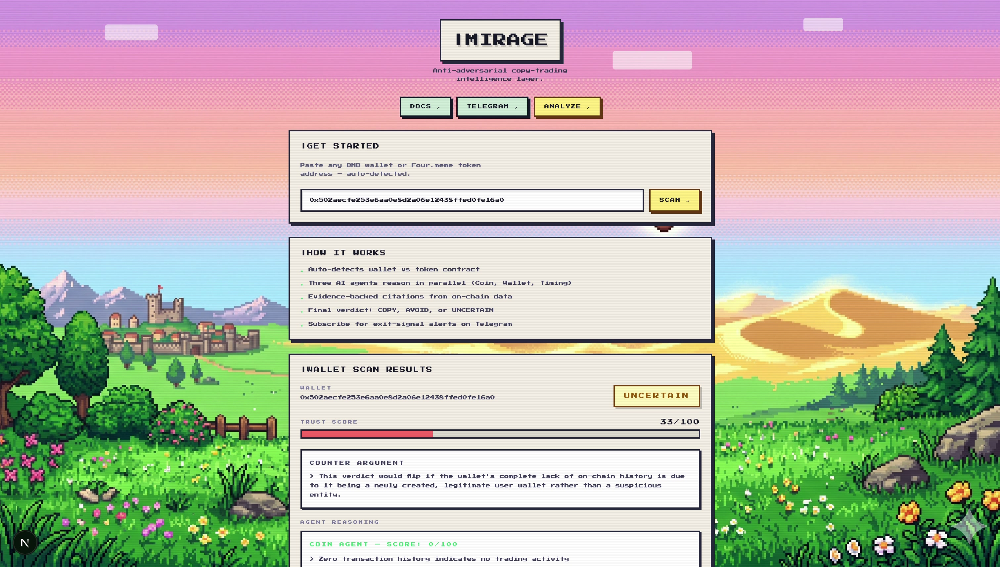
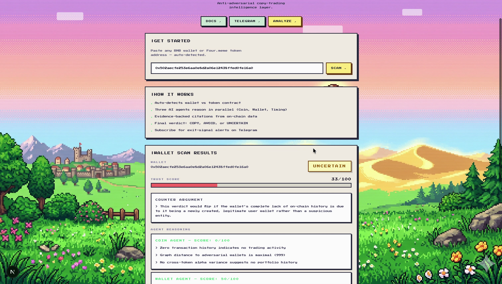
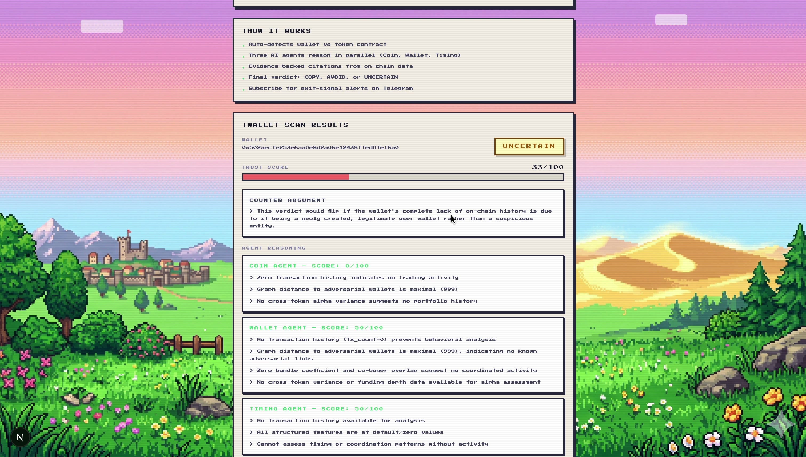
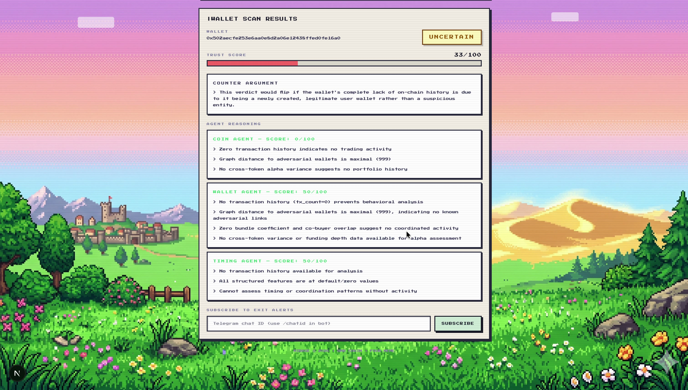
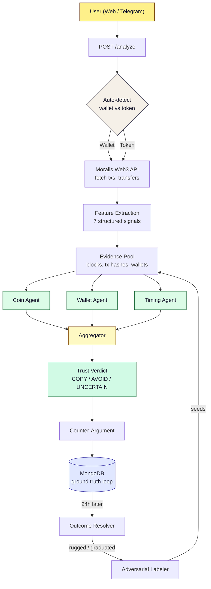

# MIRAGE — Anti-Adversarial Copy-Trading Intelligence

> *Every other tool tells you who's winning. Mirage tells you who's cheating.*

Mirage is an anti-adversarial intelligence layer for memecoin copy-trading on **Four.meme** and **BNB Chain**. It uses a multi-agent LLM system with chain-of-thought reasoning to analyze wallets and tokens, producing explainable **Trust Verdicts** (Copy / Avoid / Uncertain) backed by on-chain evidence citations.

Inspired by the research direction established by [Luo et al. (ACM WWW 2026)](https://arxiv.org/abs/2601.08641), which proved multi-agent CoT detects adversarial memecoin wallets on Solana. Mirage productizes this approach for **BNB Chain** with extensions: evidence-cited reasoning, counter-arguments, continuous trust scoring, and a ground-truth feedback loop.

---

## Product Screenshots

### Dashboard — Paste any address, get an instant verdict


### Wallet Verdict — Trust score, counter-argument, and three agent analyses


### Agent Reasoning — Each agent scores independently with cited evidence


### Exit Watchdog — Subscribe to Telegram alerts when a wallet starts distributing


---

## The Problem

Hundreds of thousands of retail traders copy "smart money wallets" on Four.meme daily. They lose — because most of those wallets are adversarial bots built to farm copy-traders via bundle coordination, sniper positioning, wash trading, and social manipulation.

Existing tools (GMGN, Axiom, BullX) rank wallets by PnL — the exact metric adversarial bots are engineered to optimize. **No tool on BNB Chain reasons about whether a "smart money" wallet is itself adversarial.**

## The Solution

Mirage does not display wallets — it *reasons* about them. For every wallet and token:

1. **Three specialized AI agents** (Coin, Wallet, Timing) evaluate structured on-chain features
2. Every claim must **cite a block number, tx hash, or wallet address** from the evidence pool
3. An **Aggregator** produces a final verdict with a **counter-argument** explaining what would invalidate it
4. A **feedback loop** verifies verdicts against on-chain outcomes after 24h

---

## Architecture



### Tech Stack

| Layer | Choice |
|-------|--------|
| Data ingestion | Moralis Web3 API (BSC) |
| Feature store | MongoDB Atlas + 30-day TTL cache |
| Orchestration | LangGraph (Python) |
| LLM inference | DeepSeek via OpenAI-compatible API |
| Telegram bot | grammY (TypeScript) |
| Web dashboard | Next.js 16 + Tailwind CSS 4 |
| API | FastAPI + uvicorn |

---

## Features

### P0 — Hackathon MVP

- **Wallet Trust Verdict API** (`POST /analyze_wallet`) — Multi-agent reasoning on wallet funding, behavior, and timing patterns
- **Token Trust Verdict** (`POST /analyze_token`) — Analyzes early buyers, computes bundle contamination %, graduation probability, ranked buyer table
- **Auto-Detect Router** (`POST /analyze`) — Smart endpoint that detects wallet vs ERC-20 token contract automatically
- **Telegram Bot** ([@NiksSupportkb_bot](https://t.me/NiksSupportkb_bot)) — Paste any address, get formatted verdict cards with inline expand for reasoning
- **Web Dashboard** — Pixel-themed Next.js app with auto-detect, results display, and subscribe
- **Three-Agent Reasoner** — LangGraph orchestration of Coin, Wallet, Timing agents with evidence-cite enforcement
- **Exit Watchdog** — Subscribe to wallets, get Telegram alerts when distribution behavior is detected
- **Feedback Loop** — Outcome resolver verifies verdicts after 24h; adversarial labeler seeds detection from confirmed rugs

### Feature Pipeline

| Feature | Description |
|---------|-------------|
| `bundle_coefficient` | Fraction of txs sharing a block (0-1). High = coordinated bundle bot |
| `timing_entropy` | Shannon entropy of inter-tx intervals. Low = automated cadence |
| `max_co_buyer_jaccard` | Jaccard overlap between buyer sets. High = coordinated cluster |
| `graph_distance_to_adversarial` | Hops to known-adversarial wallet. 0 = is adversarial, 999 = no connection |
| `cross_token_alpha_variance` | PnL variance across tokens. Low = farm bot |
| `funding_ancestor_depth` | Length of funding chain back to CEX/null source |
| `distinct_tokens_traded` | Number of unique tokens the wallet has touched |

---

## API Endpoints

| Method | Endpoint | Description |
|--------|----------|-------------|
| `POST` | `/analyze` | Auto-detect wallet vs token, run appropriate pipeline |
| `POST` | `/analyze_wallet` | Wallet trust verdict with reasoning traces |
| `POST` | `/analyze_token` | Token verdict with ranked early buyers |
| `POST` | `/subscribe` | Subscribe Telegram chat to exit alerts |
| `POST` | `/unsubscribe` | Remove subscription |
| `GET` | `/verdicts` | List verdict history |
| `GET` | `/accuracy` | Verdict-vs-outcome accuracy report |
| `GET` | `/healthz` | Component health check |
| `POST` | `/admin/run_labeler` | Manual adversarial labeling trigger |
| `POST` | `/admin/run_resolver` | Manual outcome resolver trigger |

---

## Getting Started

### Prerequisites

- Node.js 18+
- Python 3.10+

### Installation

```bash
git clone https://github.com/SAHU-01/Mirage.git
cd Mirage
```

### 1. Engine (Python)

```bash
cd apps/engine
cp .env.example .env
# Fill in your API keys in .env
pip install -r requirements.txt
uvicorn main:app --reload --port 8000
```

### 2. Telegram Bot (TypeScript)

```bash
cd apps/bot
cp .env.example .env
# Fill in TELEGRAM_BOT_TOKEN
npm install
npm run dev
```

### 3. Web Dashboard (Next.js)

```bash
cd apps/web
npm install
npm run dev
```

### Environment Variables

```env
# LLM Provider
DEEPSEEK_API_KEY=         # DeepSeek API key
LLM_MODEL=deepseek-chat   # Model name
LLM_BASE_URL=https://api.deepseek.com/v1

# On-Chain Data
MORALIS_API_KEY=           # Moralis Web3 API (free tier covers BSC)

# Datastore
MONGODB_URI=               # MongoDB connection string
MONGODB_DB=mirage          # Database name

# Alerts
TELEGRAM_BOT_TOKEN=        # Telegram bot token
```

---

## Research Backing

Inspired by: Luo et al., *"Resisting Manipulative Bots in Meme Coin Copy Trading: A Multi-Agent Approach with Chain-of-Thought Reasoning"*, ACM WWW 2026, [arXiv:2601.08641](https://arxiv.org/abs/2601.08641).

The paper proves multi-agent CoT outperforms single-model analysis for adversarial wallet detection on Solana/Pump.fun (67% precision, 70% wallet selection accuracy). Mirage takes this core thesis and builds a productized version for BNB Chain/Four.meme with several extensions not in the paper:

| | Paper (Luo et al.) | Mirage |
|---|---|---|
| Chain | Solana / Pump.fun | BNB Chain / Four.meme |
| Agents | 4 (Meme, Wallet, Wealth, DEX) | 3 + Aggregator (Coin, Wallet, Timing) |
| Output | Binary (good/bad) | Continuous Trust Score 0-100 |
| Reasoning | Free-form CoT | Evidence-cited (must cite block/tx/wallet) |
| Counter-argument | No | Yes — explains what would invalidate verdict |
| Feedback loop | No | Yes — outcome resolver verifies after 24h |
| Auto-execution | Yes (Wealth + DEX agents) | No — intelligence layer only |
| Multimodal | Yes (charts + comments) | No — structured features only |
| Features | Bundle detection, wash trading score | Bundle coeff, timing entropy, co-buyer Jaccard, graph distance to adversarial, cross-token alpha variance |

---

Built for the **Four.meme AI Sprint** (April 8-22, 2026) | BNB Chain
